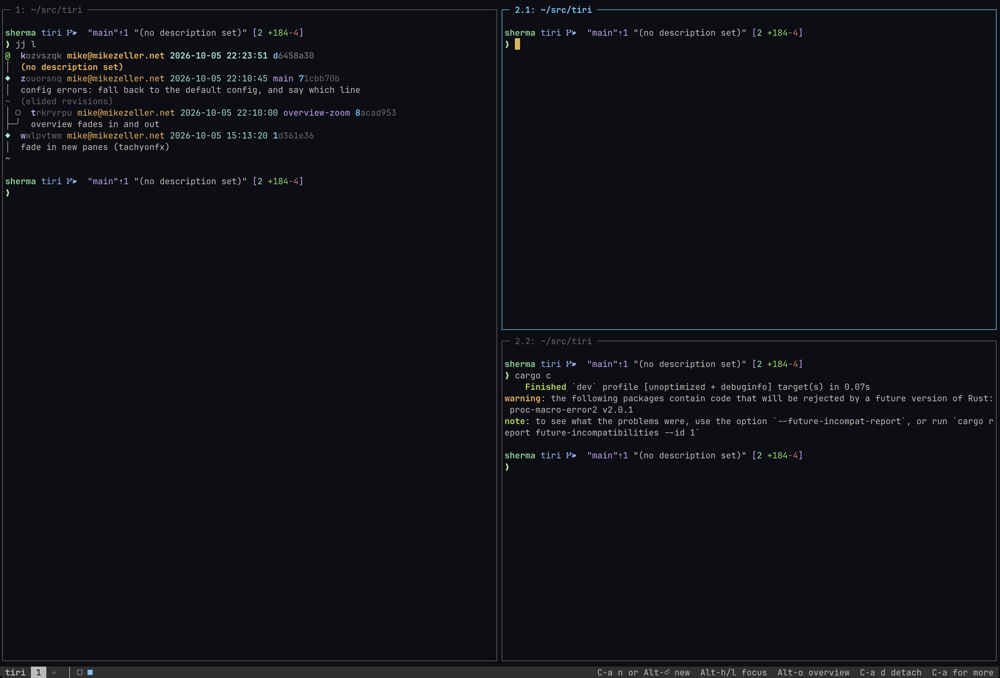

# tiri

A terminal multiplexer whose panes scroll sideways, like the
[niri](https://github.com/YaLTeR/niri) window manager.

Opening a pane never squeezes the others. Each one gets a column on an
endless strip that scrolls to keep the focused column on screen.
Workspaces stack vertically above and below each other, and they keep
running when you detach, like tmux sessions.



tiri runs on macOS and illumos. It should work on Linux too, but hasn't
been tested there yet.

## Getting started

Building needs Rust 1.88 or newer.

```sh
cargo install --path .
tiri
```

`tiri` attaches to the server, starting it if there isn't one, and gives
you a shell. A few keys to start with:

| Keys | Does |
|---|---|
| `Ctrl+a` `n` or `Alt+Enter` | Open a new column to the right |
| `Alt+h` / `Alt+l` | Focus the column to the left or right |
| `Alt+o` | Open the overview |
| `Ctrl+a` `d` | Detach, leaving everything running |
| `Ctrl+a` | Then any key: the status bar lists them |

Run `tiri` again to attach. You can attach from several terminals at once.

## How it's laid out

| Term | What it is |
|---|---|
| **Pane** | One terminal, running a shell or another program. |
| **Column** | One or more panes stacked vertically, sharing the screen's height. New columns open to the right of the focused one and never resize the others; the view scrolls instead. |
| **Strip** | A workspace's row of columns. It can be wider than the screen and scrolls sideways. |
| **Workspace** | One strip. Workspaces stack vertically, and you move up and down between them. They're what tmux calls sessions: they keep running when you detach. |
| **Named workspace** | A workspace you created with `tiri new <name>`. It stays even when empty, and `tiri attach <name>` takes you back to it. There's no way to rename or remove one yet; it lasts until the server stops. |
| **Overview** | A zoomed-out view of every workspace and column, for finding and moving things. In terminals that can show images (kitty's graphics protocol, as in Ghostty and kitty), each pane is drawn as a picture of its screen. |


Unnamed workspaces come and go as needed: one disappears once it's empty
and nobody is on it. There's always an empty workspace at the bottom,
shown as `+` in the status bar. Move down to it and open a column to start
something new.

Panes in a column can be rearranged niri-style. **Consume** pulls a pane
into the neighboring column's stack, and **expel** pushes a pane out into
a column of its own. A column can be **maximized** to the full width, or a
pane made **fullscreen** within its column.

## Keys

Every key below can be changed in the [config](#config).

There are three sets of keys:
- **After the prefix** (`Ctrl+a`, like tmux's). Press the prefix twice to
  send it to the pane. After the prefix you can keep holding Ctrl:
  `Ctrl+a Ctrl+n` is the same as `Ctrl+a n`.
- **With Alt**, working straight away, like niri's Mod keys. On macOS,
  these need your terminal's "Option as Meta" setting.
- **In the overview**, which takes the keyboard: nothing you type there
  reaches the panes.

| After `Ctrl+a` | With `Alt` | In the overview | Does |
|---|---|---|---|
| `n`, `Enter` | `Alt+Enter` | `n` | Open a new column |
| `h` `l` / `←` `→` | `Alt+h` `Alt+l` | `h` `l` | Focus the column to the left or right |
| `j` `k` / `↓` `↑` | `Alt+j` `Alt+k` | `j` `k` | Focus the pane below or above |
| `0` `$` / `Home` `End` | | `0` `$` | Focus the first or last column |
| `H` `L` | `Alt+H` `Alt+L` | `H` `L` | Move the column left or right |
| `J` `K` | `Alt+J` `Alt+K` | `J` `K` | Move the pane down or up its stack |
| `[` `]` | `Alt+{` `Alt+}` | `[` `]` | Consume into, or expel from, the column to the left or right |
| `,` | `Alt+,` | `,` | Consume the next column's top pane into this column |
| `.` | `Alt+.` | `.` | Expel the focused pane into a column of its own |
| `u` `i` / `PgDn` `PgUp` | `Alt+u` `Alt+i` | `u` `i` | Go to the workspace below or above |
| `U` `I` | `Alt+U` `Alt+I` | `U` `I` | Move the column to the workspace below or above |
| `r` | `Alt+r` | `r` | Switch the column's width: ⅓, ½, ⅔ or full, [or your own](#sizes) |
| `R` | `Alt+R` | `R` | Switch a stacked pane's height: ⅓, ½ or ⅔, [or your own](#sizes) |
| `f` | `Alt+f` | `f` | Maximize the column, or put it back |
| `F` | `Alt+F` | `F` | Make the pane fullscreen in its column, or put it back |
| `c` | `Alt+c` | | Center the column |
| `o` | `Alt+o` | `o`, `Enter`, `Esc` | Open or close the overview |
| | | `t` | Show panes as pictures or as text |
| `x` | | `x` | Close the pane |
| `d` | | | Detach |
| `q` | | | Kill the server and every pane in it |

### Mouse

- **Click** a pane to focus it. Programs that ask for the mouse get your
  clicks once their pane is focused.
- **Scroll** with the wheel through a pane's history. Typing goes back to
  the live screen.
- **Shift+scroll** steps one column left or right.
- **Drag** to select text, **double-click** for a word, **triple-click**
  for a line. The selection is copied to your terminal's clipboard.
- **Click** a workspace or a column marker in the status bar to go there.

There's no keyboard copy mode yet: scrolling back and selecting need the
mouse.

## Commands

| Command | Does |
|---|---|
| `tiri` | Attach, starting the server if needed |
| `tiri attach <name>` | Attach to a named workspace |
| `tiri new <name>` | Create a named workspace with a shell, and attach to it |
| `tiri ls` | List the workspaces |
| `tiri kill-server` | Stop the server and every pane in it |
| `tiri config default` | Print the default config |

The server listens on a socket in a private, per-user directory:
`$XDG_RUNTIME_DIR/tiri/default` if that variable is set, or
`/tmp/tiri-<uid>/default`. Choose another with `-S <path>` or
`TIRI_SOCKET`. Its log is beside it, as `default.log`; `TIRI_LOG=debug`
makes it more talkative.

The server stops by itself when its last pane closes.

## Config

tiri reads `~/.config/tiri/config.kdl` (or
`$XDG_CONFIG_HOME/tiri/config.kdl`), written in
[KDL](https://kdl.dev) like niri's. Start from the default, which lists
every setting, key and action:

```sh
mkdir -p ~/.config/tiri
tiri config default > ~/.config/tiri/config.kdl
```

The config is read each time a terminal attaches, so changes apply from
your next `tiri`. If it has a mistake, tiri uses the default config
instead, and the status bar names the line at fault. The full report is in
the server's log.

### Keys

Your bindings add to the defaults. A key you bind replaces its default,
and `unbind` removes one:

```kdl
prefix "Ctrl+b"

prefix-binds {
    v { new-column; }
    n { unbind; }
}

binds {
    Alt+n { new-column; }
}
```

Keys are written like niri's: `Alt+Enter`, `Ctrl+b`, `Shift+h` (or just
`H`), `PageUp`, `F5`. Characters KDL keeps for itself go in quotes, such
as `"["` and `"Alt+,"`.

Unlike niri, a key can run several actions, one after another. This opens
two shells stacked in one column:

```kdl
binds {
    Alt+t { new-column; new-column; consume-or-expel-pane-left; }
}
```

### Sizes

`Ctrl+a r` steps the focused column through preset widths, and new
columns open at a default width. In a column of stacked panes, `Ctrl+a R`
steps the focused pane through preset heights; the panes without one
share what's left, and the `reset-pane-height` action puts a pane back to
sharing. Set them as niri does:

```kdl
layout {
    preset-column-widths {
        proportion 0.5
        proportion 0.75
        fixed 100
    }
    default-column-width { proportion 0.5; }
    preset-pane-heights {
        proportion 0.25
        proportion 0.75
    }
}
```

A `proportion` is a share of the screen's width or height, above 0 and at
most 1. `fixed` is a number of characters across or lines down, borders
included. Columns and panes keep their size when you change the presets.

### Themes

Themes color tiri's own borders, status bar and hints; pane contents keep
your terminal's colors. Two are built in: `default`, which uses your
terminal's palette, and `oxide`.

```kdl
theme "mine"

define-theme "mine" based-on="oxide" {
    focused-border "#00d992"
    dim 242
}
```

Colors are `"#rrggbb"`, or 0 to 255 for a color from your terminal's
palette. Anything you leave out comes from `based-on`.

## License

tiri is licensed under the [Mozilla Public License 2.0](LICENSE).
